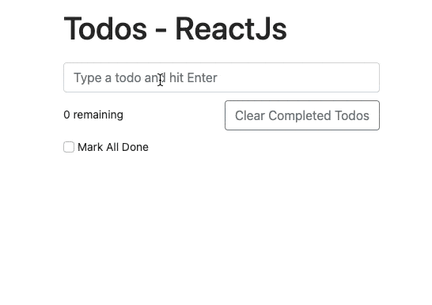

# Todo List

Requirements:

- [x] Add a new todo
- [x] Mark a todo as completed / uncompleted
- [x] Mark all todos as completed
- [x] Clear all completed todos
- [x] Display the number of active todos

Code link: `https://codesandbox.io/p/sandbox/full-stack-hw13-ld3k5s`
file: `App1`