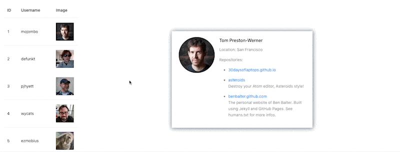

# GitHub List

## Description

## Requirements

- [ ] Show a list of GitHub users with their avatar and username, which is retrieved from the [GitHub API](https://api.github.com/users).
- [ ] Each user in the list is clickable, and it will show the user's profile page on the right side.
- [ ] The user's profile page should show the user's avatar, username, name, and some repositories of the user.