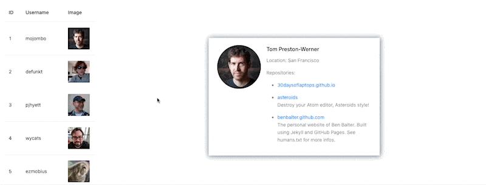

# GitHub List

## Description

## Requirements

- [x] Show a list of GitHub users with their avatar and username, which is retrieved from the [GitHub API](https://api.github.com/users).
- [x] Each user in the list is clickable, and it will show the user's profile page on the right side.
- [x] The user's profile page should show the user's avatar, username, name, and some repositories of the user.

code link: `https://codesandbox.io/p/sandbox/full-stack-hw14-g5g6tp?file=%2Fsrc%2FApp1.js`
file: `App1`