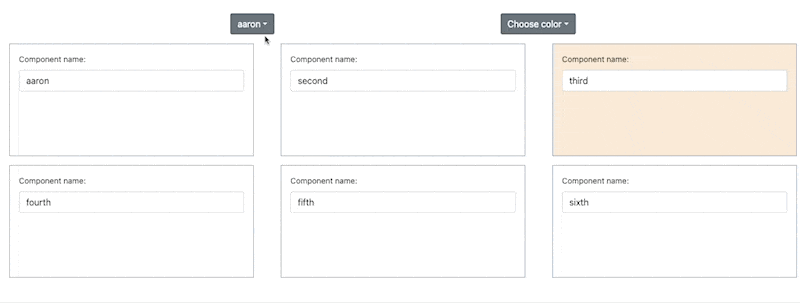

# Color Components

## Description

## Requirements

- [ ] Two controlled components to controll which single component to be selected and which color to show, respectively.
- [ ] The color component should be a single component, which is a square with a background color, and name of the component.
- [ ] When the name of the component is changed, it should be reflected in the component where the user chooses which component to be selected.
